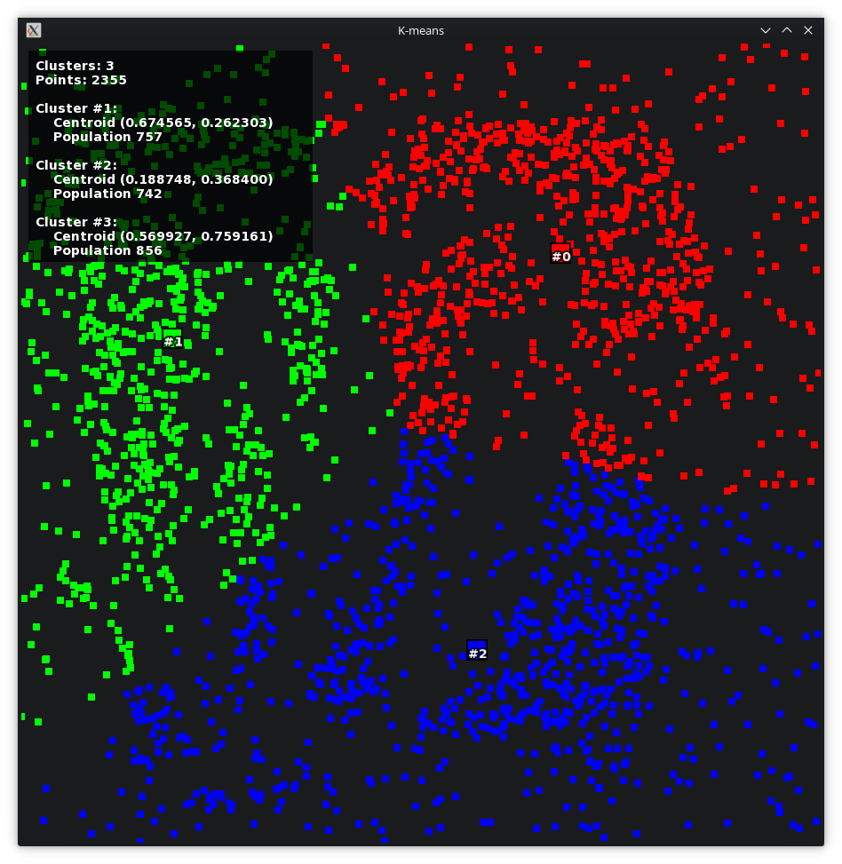

# K-means visualization 

This is a simple 2D visualization program for [k-means clustering](https://en.wikipedia.org/wiki/K-means_clustering).

This requires SFML and (probably) a compiler with C++1z support.

License for the C++ sources may be found at [`LICENSE.md`](LICENSE.md).  
License for the third-party software bundled with this repository may be found at [`THIRDPARTY.md`](THIRDPARTY.md).

### Usage

| Button       | Description              |
|--------------|--------------------------|
| `[LMB]`      | Add points near cursor   |
| `[RMB]`      | Erase points near cursor |
| `[Space]`    | Iterate k-means once     |
| `[R]`        | Randomize all points     |
| `[Up]`       | Add a cluster            |
| `[Down]`     | Remove a cluster         |
| `[Numpad +]` | Add randomized points    |
| `[Numpad -]` | Remove recent points     |
| `[Escape]`   | Exit                     |
